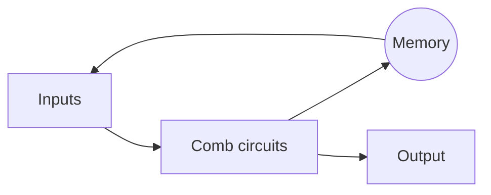
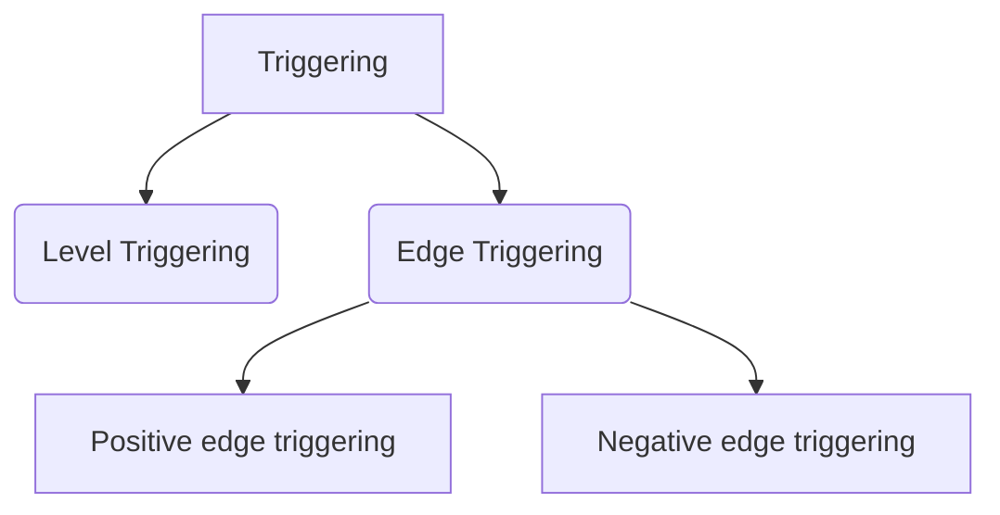

# Sequential Logic circuits

## Flip-flops

sequential circuits are the circuits with memory element and the output of the current output depends on the present as well as the past inputs.
For the memory element we use flip-flops or latches, (initial ideology was to use cascaded not gates )

### SR latch
A latch is a sequential circuit that latches  0 or 1. But since we are latching it and if the inputs  are changing then the stored result will be lost, hence we use the clock. 
#### Nor Gate Implementation
 

#### NAND gate implementation 

// Invalid conditions Explanation

#### Clock
since in sequential circuits, outputs are depended upon the inputs, and we want to latch a certain term. We cannot let the inputs change randomly.
For this we are using a clock digital signal called clock that ensures that the inputs are changed only during
- When the clock is high.
- leading edge
-  falling edge
$$
Duty cycle = time:high/total 
$$

#### Triggering methods in flip-flop
triggering is referring to the act of making changes to the input signal based on the clock pulse. Clock pulse is given to the memory element(Latch/ FlipFlop)

#### Latch and FlipFlop
level triggered/Enable --> Latch
Edge triggered --> Flip FLop
#### SR FLIP FLOP
in nand gate implementation of SR FF to accommodate clk we are introducing two more gates as per the figure, s* = S'+clk`, r*=  r'+clk' 
ie when the clock is low s=r=X s*=r*=1, ie for NAND gate it's a Unused state.
if clock is high then values will be that of set and reset.

$$
	Q_{n+1}= S+Q_nR'
$$
#### D FlipFlop
Principle behind D flipflop is that, in SR ff if clock is low then it will be memory condition and S is always opposite to R hence.

#### JK FLIPFLOP

Making use of 1,1undetermined condition. ie here when J=k=1 occur values of Q and Q_n+1 toggles and racearound condition exists.

#### RACE AROUND CONDITION
// difference between race around and toggling.

#### How to Overcome the race around condition

, JK, T and D. - Master slave flip- flops, . Registers- register with parallel load. Counter design: Asynchronous counters- Binary and BCD counters, timing sequences and state diagrams. Synchronous counters- Binary Up- down counter, BCD counter.
